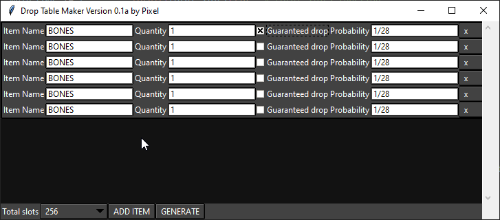

# 2011Scape Drop Table Maker



Drop Table Maker is a Python application that allows you to create drop tables for game development in 2011Scape. It provides a user-friendly interface for defining item drops and their probabilities.

## Features

- Add and remove items with customizable drop probabilities to the drop table.
- Specify guaranteed drops for certain items.
- Generate Kotlin script code based on the defined drop table.
- Save the generated code to a file.

## Installation

1. Make sure you have Python 3 installed on your system.
2. Clone this repository:

   ```bash
   git clone https://github.com/HarleyGilpin/drop-table-maker.git
   ```

# Setting up the environment

To set up a Python virtual environment in VSCode on Windows, you can use the `venv` module that comes with Python. Here are the steps to follow:

1. Open VSCode and create a new folder for your project.
2. In the Explorer pane, right-click on the folder and select "Open in Terminal".
3. In the terminal, navigate to the folder you created in step 1.
4. Run the following command to create a new virtual environment:

```bash
python -m venv env
```

This will create a directory called `myenv/bin` that contains the scripts needed to activate and deactivate the virtual environment.

5. To activate the virtual environment, run the following command:

```bash
.\env\Scripts\activate
```

This will set up the necessary environment variables and make the virtual environment active. You can verify that the virtual environment is active by checking the prompt, which should now include the name of the virtual environment.

6. To deactivate the virtual environment, run the following command:

```bash
deactivate
```

This will restore the original environment and remove the virtual environment from the current terminal session.
